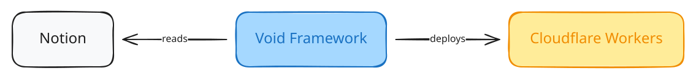

# Musubi / 結び

Musubi is a personal website framework. It reads your Notion workspace at build time and publishes a static site to Cloudflare Workers.

- **Fork, then deploy.** Fork the repository and connect it to Cloudflare Workers.
- **Write and configure the site in Notion.** No need to clone the repository, no local config file.
- **Reads Notion through the official API.** Read-only, and only the pages you share with it.
- **Built on [Void Framework](https://void.cloud/guide/pages-routing/overview) and Vue 3.**
- **Reading-first design derived from [Kami](https://github.com/tw93/Kami).**

## How it works



## Local development

Install [Vite+](https://viteplus.dev/guide/), then:

```sh
vp install
vpr dev
```

The dev server runs at `http://localhost:5173` and reads a checked-in Notion snapshot, so it needs no Notion token. `vpr ready` runs the full check and build.

## License

Musubi's source code is available under the [MIT License](./LICENSE). Fonts and the font files a build generates are not.

[Tsanger JinKai 02](https://tsanger.cn/), the default Chinese typeface, is licensed for personal use only. Do not build a commercial site with Musubi as it ships. See [Font sources and licenses](./licenses/fonts/README.md).